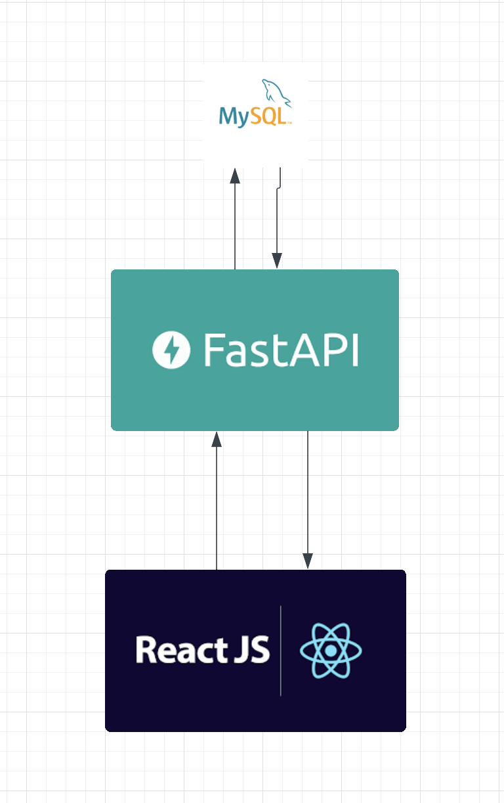

# Lecture Quiz App

[](https://github.com/benevanoff/lecture-quiz-app/actions/workflows/test.yml)

## Overview

This is an app for hosting educational content with interactive and auto-graded comprehension questions.

Teachers should be able to upload `lectures` which contain a title and text body.

Teachers should be able to create `problem_sets` for each lecture. Each problem set should reference several `problems`. Each problem should have a prompt, several multiple choice options and an answer.

Students should be able to view the lectures, submit answers to the problem sets, and instantly get feedback.

## Architecture

The backend consists of a REST API server build in [Python Flask](https://flask.palletsprojects.com) which is connected to a MySQL database.

The frontend client will be written in JavaScript.



## Infrastructure

The `infrastructure` folder defines the infrastructure necessary to deploy the application, as code.

`infrastructure/docker-compose.yml` defines a deployment template to run all the necesssary services on a single host.

The template includes
* a MySQL server with a database schema defined in `infrastructure/schema.sql`
* A REST server for the backend defined in `infrastructure/Dockerfile.backend`

To run the deployment, navigate to the `infrastructure` folder and run `docker compose up --build`

## Backend

### REST Interface

Sure, here are the descriptions for each of the `app.route` functions:

#### /register

Register a new user in the system.

Example Request:
```
POST /register
BODY:
    {
        "name": "John Doe",
        "username": "johndoe",
        "email": "johndoe@example.com",
        "password": "password123",
        "type": "student"
    }
```

#### /login

Authenticate and login a user.

Example Request:
```
POST /login
BODY:
    {
        "username": "johndoe",
        "password": "password123"
    }
```

#### /logout

Logout the currently logged-in user.

Example Request:
```
POST /logout
```

#### /profile/update

Update the profile information of the currently logged-in user.

Example Request:
```
POST /profile/update
HEADERS:
    Authorization: Bearer <access_token>
BODY:
    {
        "name": "John Doe",
        "email": "johndoe@example.com"
    }
```

#### /reset_password

Reset the password for the currently logged-in user.

Example Request:
```
POST /reset_password
HEADERS:
    Authorization: Bearer <access_token>
BODY:
    {
        "old_password": "oldpassword",
        "new_password": "newpassword"
    }
```

#### /lectures

List the IDs of available lectures from the database.

The `/lecture/{lecture_id}` can be used to fetch details about the lecture.

Example Request:
```
GET /lectures
```

#### /l{lecture_id}

List the lecture title and body content for a specific lecture.

Example Request:
```
GET /l1
```

#### /lecture/create

Privileged users may add new lectures to the database.

For authorization, a `token` must be passed in the request headers.

Example Request:
```
POST /lecture/create
HEADERS:
    Content-Type: application/json
    Authorization: Bearer <access_token>
BODY:
    {
        "title": "Introduction to C++, Unit 1: Primitive Data Type",
        "body": "Lorem Ipsum..."
    }
```

#### /l{lecture_id}/edit

Edit the details of an existing lecture.

For authorization, a `token` must be passed in the request headers.

Example Request:
```
POST /l1/edit
HEADERS:
    Content-Type: application/json
    Authorization: Bearer <access_token>
BODY:
    {
        "title": "Introduction to C++, Unit 1: Primitive Data Types",
        "body": "Lorem Ipsum..."
    }
```

#### /l{lecture_id}/delete

Delete an existing lecture from the database.

For authorization, a `token` must be passed in the request headers.

Example Request:
```
POST /l1/delete
HEADERS:
    Authorization: Bearer <access_token>
```

#### /l{lecture_id}/problemsets

List the IDs of problem sets available for a specific lecture.

Example Request:
```
GET /l1/problemsets
```

#### /l{lecture_id}/problemset/create

Privileged users may add new problem sets to a lecture.

For authorization, a `token` must be passed in the request headers.

Example Request:
```
POST /l1/problemset/create
HEADERS:
    Content-Type: application/json
    Authorization: Bearer <access_token>
BODY:
    {
        "title": "Problem Set 1",
        "body": "Lorem Ipsum..."
    }
```

#### /l{lecture_id}/ps{problemset_id}/edit

Edit the details of an existing problem set.

For authorization, a `token` must be passed in the request headers.

Example Request:
```
POST /l1/ps1/edit
HEADERS:
    Content-Type: application/json
    Authorization: Bearer <access_token>
BODY:
    {
        "title": "Problem Set 1 - Updated",
        "body": "Updated body content..."
    }
```

#### /l{lecture_id}/ps{problemset_id}/delete

Delete an existing problem set from the database.

For authorization, a `token` must be passed in the request headers.

Example Request:
```
POST /l1/ps1/delete
HEADERS:
    Authorization: Bearer <access_token>
```

#### /l{lecture_id}/ps{problemset_id}

Get details of a specific problem set.

Example Request:
```
GET /l1/ps1
```

#### /l{lecture_id}/ps{problemset_id}/problem/create

Privileged users may add new problems to a problem set.

For authorization, a `token` must be passed in the request headers.

Example Request:
```
POST /l1/ps1/problem/create
HEADERS:
    Content-Type: application/json
    Authorization: Bearer <access_token>
BODY:
    {
        "title": "Problem 1",
        "body": "Lorem Ipsum..."
    }
```

#### /l{lecture_id}/ps{problemset_id}/p{problem_id}/edit

Edit the details of an existing problem.

For authorization, a `token` must be passed in the request headers.

Example Request:
```
POST /l1/ps1/p1/edit
HEADERS:
    Content-Type: application/json
    Authorization: Bearer <access_token>
BODY:
    {
        "title": "Problem 1 - Updated",
        "body": "Updated body content..."
    }
```

#### /l{lecture_id}/ps{problemset_id}/p{problem_id}/delete

Delete an existing problem from the database.

For authorization, a `token` must be passed in the request headers.

Example Request:
```
POST /l1/ps1/p1/delete
HEADERS:
    Authorization: Bearer <access_token>
```
